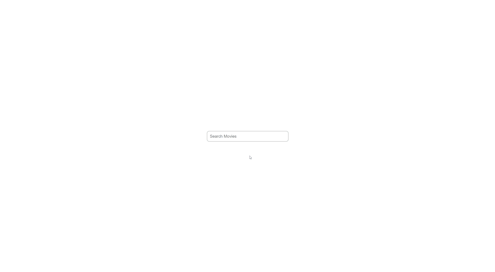

# Auto Complete Component!



## How to run the app

### Installing dependencies

with node installed, in the root directory of the project run in order to install dependencies

```sh
$ npm install
```

Or

```sh
$ yarn install
```

### Running the Backend

to run the mocked Backend for testing, in the root directory run

```sh
$ npm run start:server
```

or

```sh
$ yarn start:server
```

by default the server runs on port 3001, if you want to modify this change the start:server script to the port of your choice, also make sure to update the `REACT_APP_API_URL` variable inside .env file

### Running the Frontend

make sure the value for `REACT_APP_API_URL` is matching your running back end and in the root directory run

```sh
$ npm run start
```

or

```sh
$ yarn start
```
